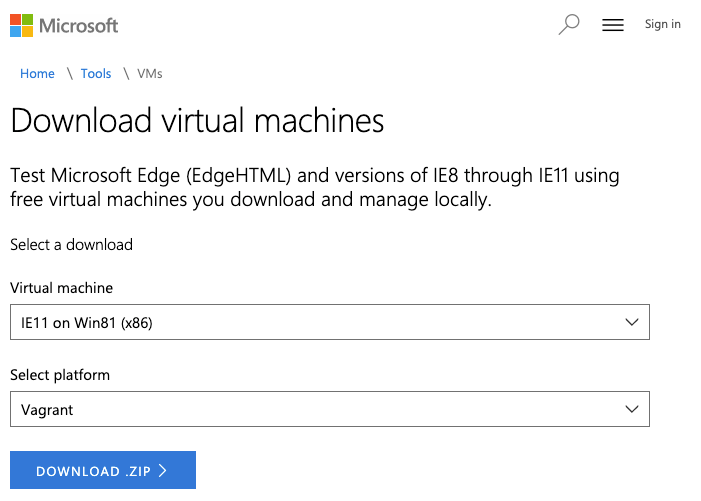

# ie11

## Setup




1. Download virtual machines from https://developer.microsoft.com/en-us/microsoft-edge/tools/vms/ .
2. Unzip the downloaded ZIP file and extract the *box* file.
3. Register the decompressed box file to `Vagrant` .
4. Start the virtual machine.

## command example

```bash
# unzip box file
unzip IE11.Win81.Vagrant.zip

# box add
vagrant box add ie11 IE11\ -\ Win81.box

# up, suspend or halt 
vagrant up 
vagrant suspend 
vagrant halt
```
